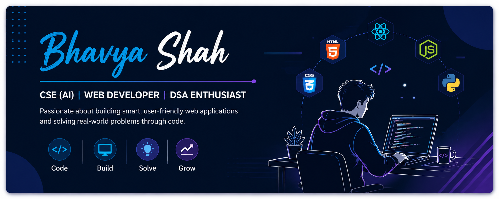

  

<h1 align="center">Hi there, I'm Bhavya Shah 👋</h1>

  

  
  

---

### 🧑‍💻 About Me

- 🎓 B.Tech in Computer Science & Engineering (AI) at **Parul University**
- 💡 Passionate about building practical, real-world software solutions
- 🌱 Currently sharpening skills in **Java, Data Structures & Algorithms, and Web Development**
- 🏆 Solved **250+** DSA problems and an active **hackathon participant**
- 🤝 Open to internship opportunities, collaborations, and open-source contributions

---

### 🛠️ Tech Stack

  
  
  
  
  
  
  
  
  

---

### 🚀 Featured Projects

| Project | Description |
|---|---|
| 🌱 **[AgroSphere](https://github.com/Bhavyashah2710)** | A solution built to support the agriculture domain |
| 🛡️ **[GigShield](https://github.com/Bhavyashah2710/GigShield)** | A hackathon project focused on gig-worker protection |
| ✅ **[Hackathon Task Manager](https://github.com/Bhavyashah2710/hackathon-task-manager)** | A lightweight Flask-based task manager built for hackathon teams |
| 📁 **[BS File Hub](https://github.com/Bhavyashah2710/BS-File-Hub)** | A basic webpage to upload and download files |
| 🍱 **[Tiffin Service Website](https://github.com/Bhavyashah2710/Tiffin-Service-Website-by-HTML-and-CSS)** | A tiffin service website built using HTML & CSS |

---

### 🏆 Achievements

- ✅ 250+ Data Structures & Algorithms problems solved
- 🏅 Participated in multiple hackathons, building projects under real time constraints
- 📚 Consistently learning and shipping new projects while pursuing my degree

---

### 📊 GitHub Stats

  
  

  

  

---

### 📫 Connect With Me

  

  

