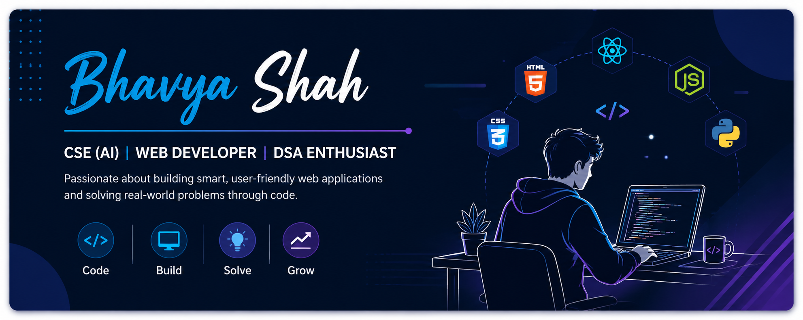
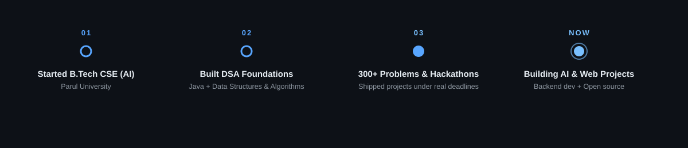

  

  

  

  
  
  

## 🧑‍💻 About

<table>
<tr>
<td width="50%" valign="top">

**🎓 Education**
B.Tech in Computer Science & Engineering (Artificial Intelligence)
Parul University

**💡 What I care about**
Building practical, real-world software — not just tutorial projects.

</td>
<td width="50%" valign="top">

**🌱 Currently sharpening**
Java · Data Structures & Algorithms · Web Development

**🤝 Open to**
Internship opportunities, collaborations, and open-source contributions

</td>
</tr>
</table>

## 🎯 Current Focus

  
  
  
  
  
  

## 🛠️ Tech Stack

  

## 🚀 Featured Projects

<table width="100%">
<tr>
<td width="50%" valign="top">

### 🌱 AgroSphere
A solution built to support the agriculture domain.

`Focus: AgriTech`

</td>
<td width="50%" valign="top">

### 🛡️ GigShield
A hackathon project focused on gig-worker protection.

`Focus: Hackathon · Social Impact`

</td>
</tr>
<tr>
<td width="50%" valign="top">

### ✅ Hackathon Task Manager
A lightweight Flask-based task manager built for hackathon teams.

`Tech: Python · Flask`

</td>
<td width="50%" valign="top">

### 📁 BS File Hub
A basic webpage to upload and download files.

`Tech: HTML · CSS · JS`

</td>
</tr>
<tr>
<td width="50%" valign="top">

### 🍱 Tiffin Service Website
A tiffin service website built using HTML & CSS.

`Tech: HTML · CSS`

</td>
<td width="50%" valign="top">

</td>
</tr>
</table>

## 🏆 Achievements

<table>
<tr>
<td align="center" width="33%">

**✅ 300+**
DSA problems solved

</td>
<td align="center" width="33%">

**🏅 Multiple**
Hackathons — real-time builds

</td>
<td align="center" width="33%">

**📚 Continuous**
Learning while shipping projects

</td>
</tr>
</table>

## 🗺️ Journey

  

## 📊 GitHub Stats & Activity

  

  

## 📫 Connect With Me

  
  

  

